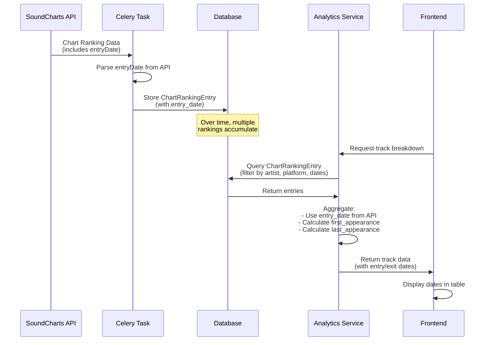

# Playlist/Chart Entry and Exit Dates Implementation

## Overview

This document details the implementation of playlist/chart entry and exit date tracking in the Music Analytics feature. This enhancement allows users to see when tracks first entered charts and when they were last seen, providing valuable insights into track lifecycle and chart performance.

## Implementation Date
**October 27, 2025**

---

## 1. Data Source

### SoundCharts API Response Structure

The SoundCharts API **already provides** the `entryDate` field in chart ranking responses:

```json
{
  "items": [
    {
      "position": 1,
      "oldPosition": 1,
      "positionEvolution": 0,
      "timeOnChart": 67,
      "metric": 12500000,
      "entryDate": "2025-06-22T12:00:00+00:00",
      "rankDate": "2025-08-23T12:00:00+00:00",
      "song": {
        "uuid": "...",
        "name": "Track Name",
        "creditName": "Artist Name"
      }
    }
  ]
}
```

**Key Fields:**
- `entryDate`: ISO 8601 datetime when the track first entered the chart (from SoundCharts)
- `rankDate`: ISO 8601 datetime of the current ranking snapshot
- `timeOnChart`: Number of weeks the track has been on the chart

---

## 2. Database Schema Changes

### New Fields Added to `ChartRankingEntry` Model

```python
class ChartRankingEntry(models.Model):
    # ... existing fields ...
    
    # Entry/Exit tracking
    entry_date = models.DateTimeField(
        null=True, blank=True,
        help_text="Date when the track first entered this chart (from SoundCharts API)"
    )
    exit_date = models.DateTimeField(
        null=True, blank=True,
        help_text="Date when the track left this chart (calculated from last appearance)"
    )
    
    # ... existing fields ...
```

### Migration
- **Migration File**: `apps/soundcharts/migrations/0025_add_entry_exit_dates_to_chart_ranking_entry.py`
- **Operations**: Added two nullable `DateTimeField` fields to the `ChartRankingEntry` model

---

## 3. Data Import Logic

### Updated `_process_ranking_entries` Function

Location: `apps/soundcharts/tasks.py`

**Changes:**
1. Extract `entryDate` from API response (`item_data.get('entryDate')`)
2. Parse ISO 8601 datetime string to Python datetime object
3. Store in `ChartRankingEntry.entry_date` field
4. Handle parsing errors gracefully with logging

```python
# Extract entry date from API (format: "2025-06-22T12:00:00+00:00")
entry_date_str = item_data.get('entryDate')
entry_date = None
if entry_date_str:
    try:
        from datetime import datetime
        entry_date = datetime.fromisoformat(entry_date_str.replace('Z', '+00:00'))
    except (ValueError, TypeError) as e:
        logger.warning(f"Could not parse entry date '{entry_date_str}': {e}")

# Create ranking entry with entry_date
entry = ChartRankingEntry.objects.create(
    # ... other fields ...
    entry_date=entry_date,
    api_data=item_data,
)
```

---

## 4. Analytics Service Integration

### Track Breakdown Aggregation

Location: `apps/soundcharts/analytics_service.py` → `get_track_breakdown_for_artist()`

**Enhanced Logic:**

1. **Track Entry Date**: Use the `entry_date` from the first `ChartRankingEntry` found for the track
2. **Calculate First Appearance**: Track the earliest `ranking_date` in our database
3. **Calculate Last Appearance**: Track the latest `ranking_date` in our database (proxy for exit date)

```python
track_data[track_id] = {
    'track_name': entry.track.name,
    'track_uuid': entry.track.uuid,
    'entry_date': entry.entry_date,  # From API
    'first_appearance': entry.ranking.ranking_date,  # Earliest in our data
    'last_appearance': entry.ranking.ranking_date    # Latest in our data
}

# Update as we iterate through entries
if entry.ranking.ranking_date < track_data[track_id]['first_appearance']:
    track_data[track_id]['first_appearance'] = entry.ranking.ranking_date
if entry.ranking.ranking_date > track_data[track_id]['last_appearance']:
    track_data[track_id]['last_appearance'] = entry.ranking.ranking_date
```

**Returned Data Structure:**

```json
{
  "tracks": [
    {
      "track_name": "Song Title",
      "track_uuid": "uuid-here",
      "total_streams": 1250000,
      "entry_date": "2025-06-22T12:00:00+00:00",
      "first_appearance": "2025-06-22",
      "last_appearance": "2025-09-15"
    }
  ]
}
```

---

## 5. Frontend Display

### Track Breakdown Table Enhancement

Location: `templates/soundcharts/analytics_search.html`

**New Table Columns:**
1. **Entry Date**: Displays when the track first entered the chart (from SoundCharts API)
2. **Last Seen**: Displays the last date the track appeared in our chart data

**JavaScript Rendering:**

```javascript
// Entry Date Column
html += '<td class="px-4 py-2 text-sm text-center text-gray-600 dark:text-gray-400">';
if (track.entry_date) {
    var entryDate = new Date(track.entry_date);
    html += entryDate.toLocaleDateString('en-US', { 
        year: 'numeric', 
        month: 'short', 
        day: 'numeric' 
    });
} else {
    html += '<span class="text-gray-400">N/A</span>';
}
html += '</td>';

// Last Seen Column
html += '<td class="px-4 py-2 text-sm text-center text-gray-600 dark:text-gray-400">';
if (track.last_appearance) {
    var lastDate = new Date(track.last_appearance);
    html += lastDate.toLocaleDateString('en-US', { 
        year: 'numeric', 
        month: 'short', 
        day: 'numeric' 
    });
} else {
    html += '<span class="text-gray-400">N/A</span>';
}
html += '</td>';
```

**Example Display:**

| Track | Total Streams | ... | Entry Date | Last Seen |
|-------|--------------|-----|------------|-----------|
| Hit Song | 12.5M | ... | Jun 22, 2025 | Sep 15, 2025 |

---

## 6. Excel Export Integration

### Track Breakdown Sheets

Location: `apps/soundcharts/views.py` → `analytics_export_excel()`

**Updated Track Sheet Columns:**

```python
track_headers = [
    'Track Name', 
    'Artist Credit', 
    'Total Streams', 
    'Avg Daily Streams', 
    'Peak Streams', 
    'Best Position', 
    'Weeks on Chart', 
    'Entry Date',      # NEW
    'Last Seen',       # NEW
    'Data Points'
]
```

**Data Export:**

```python
track_ws.cell(row=track_row, column=8, value=track.get('entry_date', 'N/A'))
track_ws.cell(row=track_row, column=9, value=track.get('last_appearance', 'N/A'))
```

---

## 7. Data Flow Diagram



---

## 8. Key Implementation Details

### Entry Date vs. First Appearance

- **Entry Date** (`entry_date`): 
  - Source: SoundCharts API (`entryDate` field)
  - Meaning: The actual date the track first entered the chart (according to SoundCharts)
  - Availability: Only if SoundCharts provides it in the API response

- **First Appearance** (`first_appearance`):
  - Source: Calculated from our database
  - Meaning: The earliest ranking date we have in our local data
  - Availability: Always available if we have any chart data

- **Last Appearance** (`last_appearance`):
  - Source: Calculated from our database
  - Meaning: The most recent ranking date we have in our local data
  - Note: This is a proxy for "exit date" - the track may still be on the chart if our data is current

### Exit Date Calculation

The `exit_date` field in the model is currently **calculated** rather than sourced from the API, because:
1. SoundCharts API does not provide an explicit "exitDate" field
2. A track "exits" when it no longer appears in subsequent chart rankings
3. We calculate this as the `last_appearance` date in our aggregated data

**Future Enhancement**: A background task could be implemented to:
1. Identify tracks that haven't appeared in charts for N days
2. Set the `exit_date` field to the last known ranking date
3. This would provide a more definitive "exit" status

---

## 9. Use Cases and Insights

### 1. Track Lifecycle Analysis
- **Question**: "How long did this track stay on the charts?"
- **Answer**: Calculate `last_appearance - entry_date` to get total chart duration

### 2. Chart Re-entries
- **Question**: "Did this track leave and come back to the charts?"
- **Detection**: If `first_appearance` is significantly later than `entry_date`, the track may have re-entered

### 3. Chart Performance Timeline
- **Question**: "When did different tracks from this artist peak?"
- **Analysis**: Compare entry dates and peak stream dates across multiple tracks

### 4. Seasonal Trends
- **Question**: "Do tracks enter charts at specific times of year?"
- **Analysis**: Aggregate `entry_date` by month/season to identify patterns

---

## 10. Testing and Validation

### Manual Testing Steps

1. **Verify Data Import**:
   ```bash
   python manage.py shell
   from apps.soundcharts.models import ChartRankingEntry
   entry = ChartRankingEntry.objects.filter(entry_date__isnull=False).first()
   print(f"Entry Date: {entry.entry_date}")
   print(f"API Data: {entry.api_data.get('entryDate')}")
   ```

2. **Verify Analytics Display**:
   - Navigate to Music Analytics page
   - Search for an artist with charting history
   - Expand track breakdown
   - Verify "Entry Date" and "Last Seen" columns display correctly

3. **Verify Excel Export**:
   - Export analytics to Excel
   - Open track breakdown sheets
   - Verify "Entry Date" and "Last Seen" columns contain data

### Sample Query for Analysis

```python
from apps.soundcharts.models import ChartRankingEntry, Track
from datetime import datetime, timedelta

# Find tracks that entered charts in the last 30 days
recent_entries = ChartRankingEntry.objects.filter(
    entry_date__gte=datetime.now() - timedelta(days=30)
).select_related('track').order_by('-entry_date')

for entry in recent_entries[:10]:
    print(f"{entry.track.name} entered on {entry.entry_date.date()}")
```

---

## 11. Future Enhancements

### Planned Improvements

1. **Exit Date Automation**:
   - Implement a Celery periodic task to identify tracks that have left charts
   - Automatically set `exit_date` field when a track hasn't appeared for 14+ days

2. **Chart Re-entry Detection**:
   - Add a `re_entry_count` field to track how many times a track has re-entered
   - Calculate and display "time off chart" periods

3. **Playlist Tracking**:
   - Extend to track when tracks enter/exit specific playlists (not just charts)
   - SoundCharts provides playlist tracking data that could be integrated

4. **Entry/Exit Events**:
   - Create a dedicated model for chart entry/exit events
   - Allow filtering and analysis of entry/exit patterns

5. **Milestone Notifications**:
   - Alert when a track reaches X days on chart
   - Notify when a track enters/exits charts

---

## 12. Related Documentation

- [Music Analytics Feature](./soundcharts_analytics_integration.md)
- [Track Breakdown Phase 2](./ARTIST_DASHBOARD_COMPLETE.md)
- [SoundCharts API Integration](./soundchart_integration.md)

---

## 13. Summary

**What was implemented:**
- ✅ Added `entry_date` and `exit_date` fields to `ChartRankingEntry` model
- ✅ Updated data import logic to extract and store `entryDate` from SoundCharts API
- ✅ Enhanced analytics service to calculate first/last appearance dates
- ✅ Updated frontend track breakdown table to display entry and exit dates
- ✅ Updated Excel export to include entry/exit dates in track sheets
- ✅ All changes are backward compatible (nullable fields)

**Data Sources:**
- `entry_date`: From SoundCharts API (`entryDate` field)
- `first_appearance`: Calculated from earliest ranking in our database
- `last_appearance`: Calculated from latest ranking in our database (proxy for exit)

**User Impact:**
- Users can now see when tracks first entered charts
- Users can see when tracks were last seen on charts
- Better understanding of track lifecycle and chart performance
- Enhanced analytics for decision-making

---

*Last Updated: October 27, 2025*
*Author: AI Assistant (Cursor)*

