# Music Analytics - Technical Architecture & API Flow

**Date**: October 20, 2025  
**Version**: 2.0 (Phase 1 + Phase 2 Complete)

---

## 📋 **Table of Contents**

1. [Overview](#overview)
2. [User Flow](#user-flow)
3. [Phase 1: Artist-Level Metrics](#phase-1-artist-level-metrics)
4. [Phase 2: Track-Level Breakdown](#phase-2-track-level-breakdown)
5. [SoundCharts API Endpoints](#soundcharts-api-endpoints)
6. [Data Aggregation Logic](#data-aggregation-logic)
7. [Data Structures](#data-structures)
8. [Extension Points](#extension-points)
9. [Performance Considerations](#performance-considerations)

---

## Overview

The Music Analytics feature provides deep insights into artist performance by aggregating:
- **Artist-level**: Monthly listeners/followers from SoundCharts API
- **Track-level**: Stream counts from chart ranking data

**Key Goals**:
- Answer "How much did Artist X do in Country Y in Month Z?"
- Show growth trends and peaks
- Identify top-performing tracks
- Support country-specific filtering

---

## User Flow

```mermaid
graph TD
    A[User Opens Analytics Page] --> B[Fill Search Form]
    B --> C{Select Parameters}
    C --> D[Artist - Autocomplete]
    C --> E[Platforms - Multi-select]
    C --> F[Date Range - Start/End]
    C --> G[Country - Optional]
    
    D --> H[Click Analyze Metrics]
    E --> H
    F --> H
    G --> H
    
    H --> I[Frontend: AJAX POST to /analytics/results/]
    I --> J[Backend: Fetch Artist-Level Data]
    J --> K[Display Results: Phase 1]
    
    K --> L[Summary Cards - Per Platform]
    K --> M[Artist × Platform Table]
    
    M --> N{User Clicks Artist Row}
    N -->|Expand| O[Frontend: AJAX GET to /analytics/api/track-breakdown/]
    O --> P[Backend: Fetch Track-Level Data]
    P --> Q[Display Track Table: Phase 2]
    
    Q --> R[Show Stream Counts, Positions, Top Track]
    
    K --> S[Click Export to Excel]
    S --> T[Backend: Generate .xlsx]
    T --> U[Download File]
```



---

## Phase 1: Artist-Level Metrics

### **Architecture Overview**

```mermaid
flowchart TB
    subgraph Frontend
        A[Search Form] --> B[AJAX POST]
    end
    
    subgraph Backend
        B --> C[analytics_search_results view]
        C --> D[analytics_service.fetch_and_aggregate_artist_metrics]
        
        D --> E{For Each Artist}
        E --> F{For Each Platform}
        
        F --> G{Platform Type?}
        G -->|Streaming| H[Call _fetch_streaming_data]
        G -->|Social| I[Call _fetch_social_data]
        
        H --> J[SoundCharts API: /api/v2/artist/{uuid}/streaming/{platform}]
        I --> K[SoundCharts API: /api/v2.37/artist/{uuid}/social/{platform}/followers/]
        
        J --> L{Country Filter?}
        K --> L
        
        L -->|Yes| M[Extract countryPlots data]
        L -->|No| N[Extract global value]
        
        M --> O[Store: date, value, artist, platform]
        N --> O
        
        O --> P{More Platforms?}
        P -->|Yes| F
        P -->|No| Q[_aggregate_fetched_data]
        
        Q --> R[Calculate: sum, avg, max, min, first, last, diff]
        R --> S[Group by Platform for Summary]
        R --> T[Group by Artist × Platform for Table]
    end
    
    subgraph Response
        S --> U[Per-Platform Summary Cards]
        T --> V[Artist × Platform Table]
        U --> W[JSON Response]
        V --> W
    end
    
    W --> X[Frontend: Render Results]
```

### **API Call Details - Phase 1**

#### **1. Streaming Platforms (Spotify, YouTube, Deezer)**

**Endpoint**: `GET /api/v2/artist/{uuid}/streaming/{platform}`

**Example**:
```
GET https://customer.api.soundcharts.com/api/v2/artist/a1b2c3d4/streaming/spotify
```

**Query Parameters**:
```python
{
    'startDate': '2024-09-01',  # YYYY-MM-DD
    'endDate': '2024-09-30',    # YYYY-MM-DD
    'offset': 0,                # Pagination (90 days max per call)
    'limit': 100                # Max results per page
}
```

**Response Structure**:
```json
{
  "items": [
    {
      "source": "spotify",
      "type": "SPOTIFY_MONTHLY_LISTENERS",
      "date": "2024-09-01",
      "value": 8234567,
      "countryPlots": [
        {
          "countryCode": "IT",
          "value": 2340000
        },
        {
          "countryCode": "US",
          "value": 1500000
        }
      ]
    },
    {
      "source": "spotify",
      "type": "SPOTIFY_MONTHLY_LISTENERS",
      "date": "2024-09-02",
      "value": 8245123,
      "countryPlots": [...]
    }
  ],
  "total": 30
}
```

**Key Fields**:
- `items`: Array of daily data points
- `items[].value`: Global metric value (monthly listeners for Spotify)
- `items[].countryPlots`: Country-specific breakdown
- `items[].date`: Date string (YYYY-MM-DD)

#### **2. Social Platforms (Instagram, TikTok, Twitter, Facebook)**

**Endpoint**: `GET /api/v2.37/artist/{uuid}/social/{platform}/followers/`

**Example**:
```
GET https://customer.api.soundcharts.com/api/v2.37/artist/a1b2c3d4/social/instagram/followers/
```

**Query Parameters**: Same as streaming

**Response Structure**:
```json
{
  "items": [
    {
      "source": "instagram",
      "type": "INSTAGRAM_FOLLOWERS",
      "date": "2024-09-01",
      "value": 5430000,
      "countryPlots": [
        {
          "countryCode": "IT",
          "value": 890000
        }
      ]
    }
  ],
  "total": 30
}
```

#### **3. Batching Logic (90-Day Limit)**

SoundCharts API limits responses to 90 days. For longer periods, we batch:

```python
def _fetch_streaming_data(self, artist_uuid, platform, start_date, end_date, country):
    all_data_points = []
    current_start = start_date
    
    while current_start < end_date:
        # Calculate batch end (max 90 days)
        batch_end = min(current_start + timedelta(days=90), end_date)
        
        # API call
        response = self.soundcharts_service.get_streaming_audience(
            artist_uuid, platform.slug, 
            start_date=current_start, 
            end_date=batch_end
        )
        
        # Extract data
        items = response.get('items', [])
        for item in items:
            # ... parse and store
            
        # Move to next batch
        current_start = batch_end + timedelta(days=1)
    
    return all_data_points
```

### **Data Aggregation - Phase 1**

```mermaid
flowchart LR
    subgraph Input
        A[Raw API Data Points]
        A1["[{date: '2024-09-01', value: 8.2M, artist: 'A', platform: 'Spotify'},
         {date: '2024-09-02', value: 8.3M, ...},
         ...]"]
    end
    
    subgraph Group By Platform
        B[Group All Artists by Platform]
        B --> B1[Spotify: All Artists Data]
        B --> B2[YouTube: All Artists Data]
        B --> B3[Instagram: All Artists Data]
    end
    
    subgraph Platform Summary Cards
        B1 --> C1[Calculate Platform Metrics]
        C1 --> C2["first_value = sorted_values[0]"]
        C1 --> C3["latest_value = sorted_values[-1]"]
        C1 --> C4["difference = latest - first"]
        C1 --> C5["period_average = sum / count"]
        C1 --> C6["peak_value = max(values)"]
        C1 --> C7["data_points = count"]
    end
    
    subgraph Group By Artist × Platform
        D[Group by Artist + Platform]
        D --> D1["Key: 'Artist A - Spotify'"]
        D --> D2["Key: 'Artist A - YouTube'"]
        D --> D3["Key: 'Artist B - Spotify'"]
    end
    
    subgraph Artist × Platform Table
        D1 --> E1[Calculate Row Metrics]
        E1 --> E2["Same as Platform Summary"]
        E1 --> E3["But per Artist × Platform"]
    end
    
    subgraph Output
        C7 --> F[Per-Platform Summary JSON]
        E3 --> G[Detailed Breakdown JSON]
    end
```

**Aggregation Formulas**:

```python
# Sort by date
sorted_data = sorted(zip(dates, values), key=lambda x: x[0])

# First value (start of period)
first_value = sorted_data[0][1] if sorted_data else 0

# Latest value (end of period)
latest_value = sorted_data[-1][1] if sorted_data else 0

# Difference (growth or decline)
difference = latest_value - first_value

# Period average
period_average = sum(values) / len(values) if values else 0

# Peak value
peak_value = max(values) if values else 0

# Data points count
data_points = len(values)
```

---

## Phase 2: Track-Level Breakdown

### **Architecture Overview**


### **Data Source - Phase 2**

**Database Model**: `ChartRankingEntry`

**Key Fields**:
```python
class ChartRankingEntry(models.Model):
    track = ForeignKey(Track)
    ranking = ForeignKey(ChartRanking)  # Contains date, chart info
    position = IntegerField()           # Chart position (e.g., 1, 2, 3)
    weeks_on_chart = IntegerField()
    api_data = JSONField()              # Contains: {"metric": 1234567, ...}
    
# api_data structure:
{
    "metric": 1234567,      # ← Stream count (key data point)
    "trend": "up",
    "previousPosition": 5,
    "peakPosition": 1
}
```

**Query**:
```python
entries = ChartRankingEntry.objects.filter(
    track__in=tracks,                           # All artist's tracks
    ranking__ranking_date__range=(start, end),  # Date filter
    ranking__chart__platform=platform           # Platform filter
).select_related('track', 'ranking', 'ranking__chart')
```

### **Data Aggregation - Phase 2**

```python
track_data = {}

for entry in chart_entries:
    track_id = entry.track.id
    
    if track_id not in track_data:
        track_data[track_id] = {
            'track_name': entry.track.name,
            'stream_counts': [],
            'positions': [],
            'dates': []
        }
    
    # Extract stream count from api_data
    metric = entry.api_data.get('metric', 0)
    track_data[track_id]['stream_counts'].append(metric)
    track_data[track_id]['positions'].append(entry.position)
    track_data[track_id]['dates'].append(entry.ranking.ranking_date)

# Calculate aggregates
for track_id, data in track_data.items():
    total_streams = sum(data['stream_counts'])
    avg_daily = total_streams / len(data['stream_counts'])
    peak_streams = max(data['stream_counts'])
    best_position = min(data['positions'])
    
    track_results.append({
        'track_name': data['track_name'],
        'total_streams': total_streams,
        'avg_daily_streams': avg_daily,
        'peak_streams': peak_streams,
        'best_position': best_position
    })

# Sort by total streams
track_results.sort(key=lambda x: x['total_streams'], reverse=True)
```

---

## SoundCharts API Endpoints

### **Complete List Used**

| Endpoint | Purpose | Phase | Frequency |
|----------|---------|-------|-----------|
| `/api/v2/artist/{uuid}/streaming/{platform}` | Streaming audience (Spotify, YouTube, Deezer) | 1 | On-demand |
| `/api/v2.37/artist/{uuid}/social/{platform}/followers/` | Social followers (Instagram, TikTok, etc.) | 1 | On-demand |
| *N/A - Uses DB* | Track stream counts from charts | 2 | From DB |

### **Authentication**

```python
headers = {
    'x-app-id': settings.SOUNDCHARTS_APP_ID,
    'x-api-key': settings.SOUNDCHARTS_API_KEY
}
```

### **Rate Limiting**

- **Limit**: Not explicitly documented, but we implement:
  - Sequential calls (not parallel)
  - 90-day batching
  - Caching in frontend
  
### **Error Handling**

```python
try:
    response = requests.get(url, headers=headers, params=params)
    response.raise_for_status()
    return response.json()
except requests.exceptions.HTTPError as e:
    if e.response.status_code == 404:
        # Artist/platform not found
    elif e.response.status_code == 429:
        # Rate limit exceeded
    elif e.response.status_code >= 500:
        # SoundCharts server error
except requests.exceptions.RequestException:
    # Network error
```

---

## Data Structures

### **Phase 1 Response JSON**

```json
{
  "success": true,
  "summary": {
    "total_artists": 1,
    "total_platforms": 2,
    "date_range": {
      "start": "2024-09-01",
      "end": "2024-09-30",
      "days": 30
    },
    "country": "IT"
  },
  "platform_summaries": [
    {
      "platform__name": "Spotify",
      "platform__slug": "spotify",
      "platform__color": "#1DB954",
      "platform__audience_metric_name": "Monthly Listeners",
      "first_value": 8200000,
      "latest_value": 9200000,
      "difference": 1000000,
      "period_average": 8500000,
      "peak_value": 9500000,
      "data_points": 30
    }
  ],
  "detailed_breakdown": [
    {
      "artist__name": "Achille Lauro",
      "artist__uuid": "a1b2c3d4",
      "platform__name": "Spotify",
      "platform__slug": "spotify",
      "platform__audience_metric_name": "Monthly Listeners",
      "current_audience": 9200000,
      "month_average": 8500000,
      "difference": 1000000,
      "peak_value": 9500000,
      "first_value": 8200000,
      "latest_value": 9200000,
      "data_points": 30
    }
  ],
  "metadata": {
    "artists": [
      {
        "id": 123,
        "name": "Achille Lauro",
        "uuid": "a1b2c3d4",
        "imageUrl": "https://..."
      }
    ],
    "platforms": [
      {
        "id": 1,
        "name": "Spotify",
        "slug": "spotify",
        "color": "#1DB954"
      }
    ]
  }
}
```

### **Phase 2 Response JSON**

```json
{
  "success": true,
  "artist": {
    "id": 123,
    "name": "Achille Lauro",
    "uuid": "a1b2c3d4"
  },
  "platform": {
    "id": 1,
    "name": "Spotify",
    "slug": "spotify"
  },
  "period": {
    "start": "2024-09-01",
    "end": "2024-09-30",
    "days": 30
  },
  "tracks": [
    {
      "track_name": "AMOR",
      "track_uuid": "t1t1t1t1",
      "track_credit": "Achille Lauro",
      "total_streams": 12500000,
      "avg_daily_streams": 416666,
      "peak_streams": 520000,
      "best_position": 1,
      "weeks_on_chart": 8,
      "data_points": 30
    },
    {
      "track_name": "Rolls Royce",
      "track_uuid": "t2t2t2t2",
      "track_credit": "Achille Lauro feat. Boss Doms",
      "total_streams": 8300000,
      "avg_daily_streams": 276666,
      "peak_streams": 350000,
      "best_position": 3,
      "weeks_on_chart": 12,
      "data_points": 30
    }
  ],
  "summary": {
    "total_tracks": 13,
    "total_streams": 45200000,
    "avg_streams_per_track": 3476923
  },
  "top_track": {
    "track_name": "AMOR",
    "total_streams": 12500000
  },
  "data_source": "chart_rankings",
  "note": "Stream counts from chart ranking data. Only includes tracks that appeared in charts during the period."
}
```

---

## Extension Points

### **Future Metrics to Add**

#### **1. Track Metrics from SoundCharts API**

**Potential Endpoint**: `/api/v2/track/{uuid}/streaming/{platform}`

**What It Could Provide**:
- Stream counts for tracks that don't chart
- More granular data
- Non-charting catalog tracks

**Implementation**:
```python
def _fetch_all_tracks_streaming(self, artist_id, platform_id, start_date, end_date):
    """
    Future: Fetch streaming data for ALL tracks, not just charted ones.
    """
    tracks = Track.objects.filter(artists__id=artist_id)
    
    all_track_data = []
    for track in tracks:
        if not track.uuid:
            continue
            
        # Call: /api/v2/track/{track.uuid}/streaming/{platform.slug}
        response = self.soundcharts_service.get_track_streaming(
            track.uuid, platform.slug, start_date, end_date
        )
        
        # Aggregate per track
        # ...
    
    return all_track_data
```

#### **2. Radio Airplay Metrics**

**Potential Endpoint**: `/api/v2/artist/{uuid}/radio/{country}`

**What It Could Provide**:
- Airplay spins count
- Radio reach
- Stations playing the track

**UI Addition**:
- New platform type: "Radio"
- Separate summary card group
- Track breakdown: spins per track

#### **3. Playlist Metrics**

**Potential Endpoint**: `/api/v2/artist/{uuid}/playlists/{platform}`

**What It Could Provide**:
- Playlist additions/removals
- Follower counts of playlists containing tracks
- Playlist reach

**UI Addition**:
- New section: "Playlist Performance"
- Track breakdown: which playlists include each track

#### **4. Shazam Recognition**

**Potential Endpoint**: `/api/v2/artist/{uuid}/shazam`

**What It Could Provide**:
- Shazam tag counts
- Discovery metrics
- Trending status

**UI Addition**:
- New metric card
- Track breakdown: most Shazamed tracks

#### **5. Sentiment Analysis**

**Potential Data**: Social media sentiment

**What It Could Provide**:
- Positive/negative mentions
- Engagement rates
- Viral moments

**UI Addition**:
- Sentiment score graph
- Top trending posts

### **Code Architecture for Extensions**

```python
# In analytics_service.py

def fetch_and_aggregate_artist_metrics(self, ...):
    """Current: Handles streaming + social"""
    results = {}
    
    # Phase 1: Artist-level
    results['streaming'] = self._fetch_streaming_metrics(...)
    results['social'] = self._fetch_social_metrics(...)
    
    # FUTURE ADDITIONS:
    # results['radio'] = self._fetch_radio_metrics(...)
    # results['playlists'] = self._fetch_playlist_metrics(...)
    # results['shazam'] = self._fetch_shazam_metrics(...)
    
    return self._aggregate_all_metrics(results)

def _fetch_radio_metrics(self, ...):
    """FUTURE: Fetch radio airplay data"""
    pass

def _fetch_playlist_metrics(self, ...):
    """FUTURE: Fetch playlist data"""
    pass
```

**Frontend Extension**:

```javascript
// In analytics_search.html

function renderResults(data) {
    // Current sections
    renderPlatformSummaries(data.platform_summaries);
    renderDetailedTable(data.detailed_breakdown);
    
    // FUTURE ADDITIONS:
    // if (data.radio_metrics) renderRadioSection(data.radio_metrics);
    // if (data.playlist_metrics) renderPlaylistSection(data.playlist_metrics);
    // if (data.shazam_metrics) renderShazamSection(data.shazam_metrics);
}
```

---

## Performance Considerations

### **Current Performance**

**Phase 1 Load Time**:
- 1 artist, 1 platform, 30 days: ~2-3 seconds
- 1 artist, 5 platforms, 30 days: ~8-10 seconds
- Multiple artists: Linear scaling

**Bottlenecks**:
1. Sequential SoundCharts API calls
2. 90-day batching for long periods
3. No caching of API responses

### **Optimizations Implemented**

✅ **Frontend Caching**: Track breakdown cached after first load  
✅ **Efficient Queries**: `select_related()` for Phase 2  
✅ **Batching**: 90-day batching for API calls  
✅ **Inline Results**: No page redirect, AJAX-based  

### **Future Optimizations**

#### **1. Background Task Processing (Celery)**

```python
# tasks.py
from celery import shared_task

@shared_task
def fetch_artist_metrics_async(artist_ids, platform_ids, start_date, end_date, country):
    """
    Run analytics fetching in background.
    Store results in cache or database.
    """
    service = AnalyticsService()
    results = service.fetch_and_aggregate_artist_metrics(
        artist_ids, platform_ids, start_date, end_date, country
    )
    
    # Store in cache
    cache_key = f"analytics:{artist_ids}:{platform_ids}:{start_date}:{end_date}:{country}"
    cache.set(cache_key, results, timeout=3600)  # 1 hour
    
    return results
```

**UI Flow**:
1. User submits search
2. Task queued, returns task ID
3. Frontend polls for completion
4. Show "Processing..." with progress bar
5. Display results when ready

#### **2. Redis Caching**

```python
from django.core.cache import cache

def fetch_and_aggregate_artist_metrics(self, ...):
    # Check cache first
    cache_key = self._generate_cache_key(artist_ids, platform_ids, start_date, end_date, country)
    cached_data = cache.get(cache_key)
    
    if cached_data:
        logger.info(f"Cache hit: {cache_key}")
        return cached_data
    
    # Fetch and cache
    results = self._fetch_fresh_data(...)
    cache.set(cache_key, results, timeout=3600)  # 1 hour cache
    
    return results
```

**Cache Invalidation**:
- TTL: 1 hour for recent data, 24 hours for historical
- Manual: Clear on data sync completion
- Key strategy: Include all parameters in key

#### **3. Database Materialized Views**

For frequently accessed historical data:

```sql
CREATE MATERIALIZED VIEW artist_monthly_metrics AS
SELECT 
    artist_id,
    platform_id,
    DATE_TRUNC('month', ranking_date) as month,
    COUNT(DISTINCT track_id) as track_count,
    SUM(metric) as total_streams,
    AVG(metric) as avg_streams,
    MAX(metric) as peak_streams
FROM soundcharts_chartrankingentry
JOIN soundcharts_chartranking ON ...
GROUP BY artist_id, platform_id, month;

CREATE INDEX idx_artist_month_metrics ON artist_monthly_metrics(artist_id, platform_id, month);
```

**Refresh Strategy**:
```python
# Refresh nightly
from django.core.management.base import BaseCommand

class Command(BaseCommand):
    def handle(self, *args, **options):
        cursor = connection.cursor()
        cursor.execute('REFRESH MATERIALIZED VIEW CONCURRENTLY artist_monthly_metrics')
```

#### **4. Parallel API Calls**

```python
import asyncio
import aiohttp

async def _fetch_all_platforms_async(self, artist_uuid, platforms, start_date, end_date):
    """
    Fetch multiple platforms in parallel using asyncio.
    """
    async with aiohttp.ClientSession() as session:
        tasks = []
        for platform in platforms:
            task = self._fetch_platform_data_async(session, artist_uuid, platform, start_date, end_date)
            tasks.append(task)
        
        results = await asyncio.gather(*tasks)
        return results
```

**Performance Gain**: 5 platforms in ~3 seconds instead of ~10 seconds

---

## Summary Diagram


---

## Quick Reference

### **Key Files**

| File | Purpose |
|------|---------|
| `apps/soundcharts/analytics_service.py` | Core aggregation logic, API calls |
| `apps/soundcharts/views.py` | View endpoints (search, results, track breakdown, export) |
| `apps/soundcharts/urls.py` | URL routing |
| `templates/soundcharts/analytics_search.html` | Frontend UI and JavaScript |
| `apps/soundcharts/service.py` | SoundCharts API client |
| `apps/soundcharts/models.py` | Database models |

### **Key Metrics**

| Metric | Source | Calculation |
|--------|--------|-------------|
| Start Value | SoundCharts API | First date's value |
| End Value | SoundCharts API | Last date's value |
| Difference | Calculated | End - Start |
| Period Average | SoundCharts API | Sum / Count |
| Peak Value | SoundCharts API | Max(values) |
| Total Streams | Chart Rankings DB | Sum(track metrics) |

### **Extension Checklist**

When adding new metrics:
- [ ] Define SoundCharts API endpoint
- [ ] Add fetch method in `analytics_service.py`
- [ ] Update aggregation logic
- [ ] Extend JSON response structure
- [ ] Add UI rendering in template
- [ ] Update Excel export
- [ ] Add documentation
- [ ] Consider caching strategy
- [ ] Add tests

---

**Last Updated**: October 20, 2025  
**Maintainer**: Development Team  
**Related Docs**: 
- `analytics_phase1_complete_enhanced.md`
- `analytics_phase2_complete.md`
- `soundcharts_integration.md`

