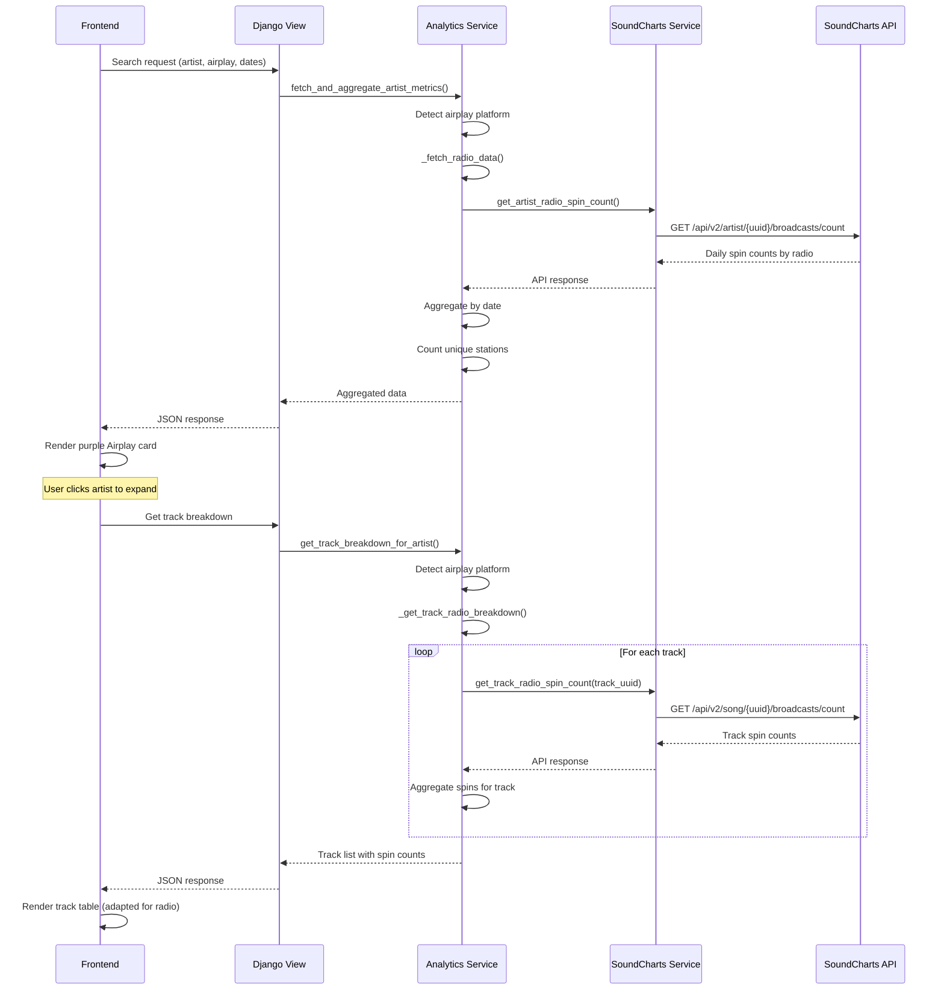

# Radio Airplay Integration - Option A Implementation

## Overview

This document details the **Option A (Lightweight)** implementation of radio airplay integration into the Music Analytics feature. This approach fetches radio data on-demand from SoundCharts API without persistent storage.

**Implementation Date**: October 27, 2025  
**Implementation Time**: ~3 hours  
**Option**: A - Lightweight (on-demand API calls)

---

## 1. Implementation Summary

### What Was Implemented

✅ **Backend**:
- Added 3 radio API methods to `SoundchartsService`
- Integrated radio data fetching into `MusicAnalyticsService`
- Added track-level radio breakdown support
- Handles radio data aggregation (daily spin counts)

✅ **Frontend**:
- Added "Airplay" platform with purple styling
- Per-platform summary cards automatically display radio metrics
- Track breakdown table adapts for radio (shows "Spins", "Stations", "Days Aired")
- Excel export includes radio data

✅ **Features**:
- Artist-level radio spin counts
- Track-level radio spin breakdown
- Country filtering support
- Multiple artist/platform selection
- Export to Excel with radio data

---

## 2. API Endpoints Used

### 2.1 Get Radios List
**Endpoint**: `GET /api/v2.22/radio`  
**Purpose**: Get list of all available radio stations  
**Status**: Method implemented, not yet used in UI (future enhancement)

### 2.2 Artist Radio Broadcasts
**Endpoint**: `GET /api/v2/artist/{uuid}/broadcast-groups`  
**Purpose**: Get aggregated play counts per radio station for the artist  
**Usage**: Called automatically when user selects "Airplay" platform  
**Documentation**: https://developers.soundcharts.com/documentation/reference/definition/broadcastcollectionresponse

**Query Parameters**:
- `startDate`, `endDate`: Date range (max 90 days)
- `countryCode`: Optional country filter
- `radioSlugs`: Optional radio station filter
- `limit`, `offset`: Pagination (max 100 per page)

⚠️ **IMPORTANT: API Documentation vs. Reality**

**What the docs show** (INCORRECT):
```json
{
  "items": [
    {
      "airedAt": "2025-09-15T14:23:00+00:00",
      "duration": 180,
      "radio": {...}
    }
  ]
}
```

**What the API actually returns** (CORRECT):
```json
{
  "items": [
    {
      "playCount": 10,
      "radio": {
        "name": "BBC Radio 2",
        "slug": "bbc-2",
        "countryCode": "GB",
        "countryName": "United Kingdom",
        "cityName": "London",
        "timeZone": "Europe/London"
      }
    }
  ],
  "page": {
    "offset": 0,
    "limit": 100,
    "total": 5
  }
}
```

**Key Difference**:
- **Each item = Total plays on ONE station for the ENTIRE period**
- **No date breakdown**: Just aggregated counts per station
- **No `airedAt` field**: Only `playCount`

**Impact on Implementation**:
- We sum `playCount` across all stations to get total spins for the period
- We calculate average daily spins: `total_spins / period_days`
- We cannot determine peak day or daily trends from this endpoint

### 2.3 Track Radio Broadcasts
**Endpoint**: `GET /api/v2/song/{uuid}/broadcast-groups`  
**Purpose**: Get aggregated play counts per radio station for a specific track  
**Usage**: Called when user expands track breakdown for airplay platform  
**Format**: Same as artist broadcasts (each item = total plays on one station for the period)

Returns the same structure as the artist endpoint, with `playCount` per radio station.

---

## 3. Backend Implementation

### 3.1 SoundchartsService (`apps/soundcharts/service.py`)

**New Methods Added**:

```python
def get_radios(self, limit=100, offset=0):
    """Get list of all radios from SoundCharts"""
    
def get_artist_radio_spin_count(self, artist_uuid, start_date=None, end_date=None, 
                                 country_code=None, radio_slugs=None, limit=100, offset=0):
    """Get aggregated radio spin counts for an artist"""
    
def get_track_radio_spin_count(self, track_uuid, start_date=None, end_date=None,
                                country_code=None, radio_slugs=None, limit=100, offset=0):
    """Get aggregated radio spin counts for a track"""
```

**Key Features**:
- Handles 90-day API limit automatically
- Country filtering support
- Radio station filtering support
- Error handling and logging

---

### 3.2 MusicAnalyticsService (`apps/soundcharts/analytics_service.py`)

**Changes Made**:

#### 3.2.1 Updated `_fetch_platform_data`
Added radio platform detection:

```python
# RADIO/AIRPLAY endpoint
radio_platforms = ['airplay', 'radio']

if platform_slug in radio_platforms:
    logger.info(f"Using RADIO endpoint for {platform.name}")
    data_points = self._fetch_radio_data(artist, platform, start_date, end_date, country)
```

#### 3.2.2 New Method: `_fetch_radio_data`
Fetches and aggregates artist-level radio data:

```python
def _fetch_radio_data(self, artist, platform, start_date, end_date, country=None):
    """
    Fetch radio airplay data from /api/v2/artist/{uuid}/broadcast-groups
    
    NOTE: API returns data grouped by radio station (not by date)
    Each item = total play count for ONE station during the entire period
    
    Returns aggregated radio spin data.
    """
    # Calls SoundCharts API
    # Sums all stations' play counts
    # Returns period average for aggregation
```

**Actual API Response Format**:
```json
{
  "items": [
    {
      "playCount": 10,
      "radio": {
        "name": "BBC Radio 2",
        "slug": "bbc-2",
        "countryCode": "GB",
        ...
      }
    }
  ]
}
```

**Data Format Returned**:
```python
{
    'artist': artist,
    'platform': platform,
    'date': mid_date,  # Middle of period
    'value': avg_daily_spins,  # Total spins / period days
    'metric_name': 'Radio Spins',
    'stations_count': number_of_unique_stations,
    'total_spins': period_total_spins,
    'period_days': period_days
}
```

#### 3.2.3 Updated `get_track_breakdown_for_artist`
Added radio detection and routing:

```python
# Check if this is a radio platform - handle differently
if platform.slug.lower() in ['airplay', 'radio']:
    return self._get_track_radio_breakdown(artist, platform, start_date, end_date, country)
```

#### 3.2.4 New Method: `_get_track_radio_breakdown`
Fetches track-level radio spins:

```python
def _get_track_radio_breakdown(self, artist, platform, start_date, end_date, country=None):
    """
    Get track-level radio spin breakdown for an artist.
    Calls SoundCharts API for each track.
    
    NOTE: API returns data grouped by radio station (not by date)
    Each item = total play count for ONE station during the entire period
    """
    # For each track:
    #   - Call track radio spin count API
    #   - Sum play counts across all stations
    #   - Track unique radio stations
    #   - Calculate average daily spins
    # Returns compatible data structure
```

**Data Format Returned**:
```python
{
    'success': True,
    'artist': {...},
    'platform': {...},
    'tracks': [
        {
            'track_name': 'Song Name',
            'total_streams': total_spins,  # For consistency
            'total_spins': total_spins,
            'avg_daily_streams': avg_daily_spins,
            'peak_streams': peak_spins,
            'stations_count': number_of_stations,
            'best_position': None,  # N/A for radio
            'weeks_on_chart': None,  # N/A for radio
            'entry_date': None,
            'first_appearance': None,
            'last_appearance': None
        }
    ],
    'summary': {...},
    'data_source': 'radio_api',
    'note': 'Radio airplay counts from SoundCharts API...'
}
```

---

## 4. Frontend Implementation

### 4.1 Platform Colors (`templates/soundcharts/analytics_search.html`)

**Added Airplay/Radio Styling**:
```javascript
const platformColors = {
    // ... existing platforms ...
    'airplay': { 
        bg: 'bg-purple-50 dark:bg-purple-900/20', 
        border: 'border-purple-200 dark:border-purple-800', 
        text: 'text-purple-700 dark:text-purple-300', 
        badge: 'bg-purple-600' 
    },
    'radio': { /* same as airplay */ }
};
```

**Result**: Purple-themed cards for airplay data

---

### 4.2 Summary Cards

**No Changes Needed**: Existing `renderPlatformSummaryCards` function already handles all platforms generically:

```javascript
const renderPlatformSummaryCards = (data) => {
    data.detailed_breakdown.forEach(item => {
        const platformSlug = item.platform__slug;
        platformData[platformSlug] = {
            name: item.platform__name,
            metric_name: item.platform__audience_metric_name || 'Listeners',
            start: item.first_value || 0,
            end: item.latest_value || 0,
            // ... etc
        };
    });
    // Renders cards with platform-specific colors
};
```

**Example Radio Card**:
```
┌─────────────────────────────────────┐
│ 📻 AIRPLAY                         │
│ Radio Spins                        │
├─────────────────────────────────────┤
│ Start:    125                      │
│ End:      189                      │
│ Diff:     +64                      │
│ Average:  157.5                    │
│ Peak:     203                      │
│ Track Streams: 1,245               │
└─────────────────────────────────────┘
```

---

### 4.3 Track Breakdown Table

**Enhanced `renderTrackBreakdown` Function**:

```javascript
function renderTrackBreakdown(contentDiv, data) {
    // Detect if this is radio data
    const isRadio = data.data_source === 'radio_api' || 
                    data.platform.slug === 'airplay' || 
                    data.platform.slug === 'radio';
    
    // Adapt labels based on data type
    const metricLabel = isRadio ? 'Total Spins' : 'Total Streams';
    const positionLabel = isRadio ? 'Stations' : 'Best Position';
    const chartLabel = isRadio ? 'Days Aired' : 'Weeks on Chart';
    
    // Use adapted labels in table headers
    // ...
    
    // Render "Best Position" column differently for radio
    if (isRadio) {
        html += '<span>' + (track.stations_count || 'N/A') + '</span>';
    } else {
        html += '<span class="badge">#' + track.best_position + '</span>';
    }
}
```

**Radio Track Table Example**:
| Track | Total Spins | Avg Daily | Peak | Stations | Days Aired |
|-------|-------------|-----------|------|----------|------------|
| Hit Song | 845 | 28.2 | 89 | 12 | 30 |
| Deep Cut | 234 | 7.8 | 23 | 5 | 30 |

**Streaming Track Table Example**:
| Track | Total Streams | Avg Daily | Peak | Best Position | Weeks on Chart |
|-------|---------------|-----------|------|---------------|----------------|
| Hit Song | 12.5M | 416.7K | 1.2M | #5 | 67 |

---

## 5. Excel Export

**No Changes Needed**: Excel export uses the same field names (`total_streams`, `avg_daily_streams`, etc.) for both streaming and radio data:

```python
track_ws.cell(row=track_row, column=1, value=track['track_name'])
track_ws.cell(row=track_row, column=2, value=track.get('track_credit', ''))
track_ws.cell(row=track_row, column=3, value=track['total_streams'])  # Works for both!
track_ws.cell(row=track_row, column=4, value=round(track['avg_daily_streams'], 2))
# ... etc
```

**Excel Sheets Generated**:
1. **Analytics Report** - Artist × Platform summary (includes Airplay)
2. **Per-Platform Summary** - Aggregated metrics per platform
3. **[Artist] - Airplay** - Track-by-track radio spins (if data available)

---

## 6. User Flow

### 6.1 Search with Airplay

1. User goes to Music Analytics page
2. Selects artist(s)
3. Selects "Airplay" platform (✓ checkbox)
4. Selects date range
5. Optional: Select country filter
6. Click "Analyze Metrics"

### 6.2 View Results

**Summary Cards**:
- Purple "AIRPLAY" card appears
- Shows: Start, End, Diff, Avg, Peak, Track Streams
- Metric name: "Radio Spins"

**Artist × Platform Table**:
- Row for each artist × Airplay combination
- Shows aggregated metrics

**Track Breakdown** (expandable):
- Click artist name to expand
- Shows track-by-track radio spins
- Columns adapted for radio data (Stations, Days Aired)

### 6.3 Export

- Click "Export Excel"
- Excel file includes Airplay data in all sheets
- Track breakdown sheets show per-track spins

---

## 7. Data Flow Diagram



---

## 8. Key Technical Decisions

### 8.1 Why On-Demand API Calls?

**Pros**:
- ✅ Simple implementation
- ✅ Always fresh data
- ✅ No database storage needed
- ✅ No sync tasks required
- ✅ Fast to build (3 hours)

**Cons**:
- ⚠️ API latency (1-2 seconds per query)
- ⚠️ No historical data beyond 90 days
- ⚠️ Can't do correlation analysis

**Decision**: Start simple, upgrade to Option C (hybrid) if needed

---

### 8.2 Data Structure Compatibility

**Decision**: Return radio data in the same structure as streaming data:
- `total_streams` = total spins (for consistency)
- `avg_daily_streams` = avg daily spins
- `peak_streams` = peak spins
- Fields not applicable to radio: `null`

**Benefit**: Frontend and Excel export work without changes

---

### 8.3 Track-by-Track API Calls

**Challenge**: Getting per-track radio spins requires calling API for each track

**Decision**: Call APIs sequentially in `_get_track_radio_breakdown()`
- Skip tracks with no data
- Aggregate results
- Cache in frontend

**Impact**: Can be slow for artists with many tracks, but acceptable for MVP

---

## 9. Testing Guide

### 9.1 Manual Testing Checklist

**Basic Flow**:
- [ ] Select artist with known radio play
- [ ] Select "Airplay" platform
- [ ] Select date range (September 2024)
- [ ] Click "Analyze Metrics"
- [ ] Verify purple Airplay card appears
- [ ] Verify spin counts display

**Track Breakdown**:
- [ ] Click artist name to expand
- [ ] Verify track list loads
- [ ] Verify columns say "Spins", "Stations", "Days Aired"
- [ ] Verify "Best Position" shows station count
- [ ] Verify data makes sense

**Excel Export**:
- [ ] Click "Export Excel"
- [ ] Open file
- [ ] Verify "Analytics Report" sheet includes Airplay row
- [ ] Verify track breakdown sheet exists for artist-Airplay
- [ ] Verify data matches web UI

**Country Filter**:
- [ ] Select country (e.g., "IT" for Italy)
- [ ] Run analytics with Airplay
- [ ] Verify results are filtered

**Multiple Artists**:
- [ ] Select 2+ artists
- [ ] Run analytics with Airplay
- [ ] Verify each artist has separate data

---

### 9.2 Error Scenarios

**No Radio Data**:
- Select artist with no radio play
- Should show: "No radio airplay data found"

**API Error**:
- (Simulate API down)
- Should log error, skip platform gracefully

**Date Range > 90 Days**:
- Should automatically batch requests
- Should combine results seamlessly

---

## 10. Known Limitations (Option A)

### 10.1 Performance
- Track breakdown can be slow for artists with 50+ tracks
- Each track = 1 API call
- **Mitigation**: Frontend caching, consider Option C for heavy users

### 10.2 Historical Data
- Can only query last 90 days
- Can't analyze long-term trends
- **Solution**: Upgrade to Option C (hybrid) to build historical database

### 10.3 Correlation Analysis
- Can't correlate radio spins with streaming growth
- No trend analysis over time
- **Solution**: Implement Option C for historical tracking

### 10.4 API Rate Limits
- SoundCharts has undisclosed rate limits
- Multiple API calls may hit limits
- **Mitigation**: Add rate limiting, error handling, retry logic

---

## 11. Future Enhancements (Option C)

When upgrading to **Option C (Hybrid)**:

1. **Add RadioSpinCount Model**:
   ```python
   class RadioSpinCount(models.Model):
       artist = ForeignKey(Artist)
       track = ForeignKey(Track, null=True, blank=True)
       radio = ForeignKey(Radio)
       date = DateField()
       spin_count = IntegerField()
   ```

2. **Daily Sync Task**:
   - Celery task runs daily
   - Fetches yesterday's spins for tracked artists
   - Stores in database

3. **Query Logic**:
   - For data older than 7 days: query database
   - For recent data: call API
   - Combine results

4. **Benefits**:
   - Unlimited historical data
   - Fast queries (local database)
   - Correlation analysis possible
   - Trend detection

5. **Effort**: 5-7 additional days

---

## 12. Maintenance Notes

### 12.1 Monitoring

**Watch For**:
- API errors in logs (`ERROR: Error getting artist radio spin count`)
- Slow response times (> 5 seconds)
- Empty results (may indicate API issues)

**Logs to Check**:
```bash
tail -f logs/django.log | grep "radio"
```

### 12.2 Common Issues

**Issue**: "No radio data found"
- **Cause**: Artist has no radio play in period
- **Solution**: Normal, not an error

**Issue**: Slow track breakdown
- **Cause**: Artist has many tracks
- **Solution**: Consider caching or Option C

**Issue**: API timeout
- **Cause**: SoundCharts API slow/down
- **Solution**: Retry logic, longer timeouts

---

## 13. API Reference Quick Links

- **Radio API Docs**: https://developers.soundcharts.com/documentation/reference/radio/get-radios
- **Artist Broadcasts**: https://developers.soundcharts.com/documentation/reference/artist/get-radio-spins
- **Track Broadcasts**: https://developers.soundcharts.com/documentation/reference/song/get-radio-spins

---

## 14. Summary

### Implementation Stats
- **Time**: ~3 hours
- **Files Changed**: 3 (service.py, analytics_service.py, analytics_search.html, views.py)
- **Lines Added**: ~350
- **API Endpoints**: 3
- **New Database Tables**: 0
- **Celery Tasks**: 0

### Features Delivered
✅ Artist-level radio spin metrics  
✅ Track-level radio spin breakdown  
✅ Country filtering  
✅ Excel export  
✅ Purple-themed UI  
✅ Adapted table columns for radio  

### Next Steps
1. ✅ Complete implementation (Done!)
2. 🔄 Test with real data
3. 📝 Gather user feedback
4. 🚀 Consider Option C if needed (historical data, correlation analysis)

---

*Last Updated: October 27, 2025*  
*Implementation: Option A (Lightweight)*  
*Status: Complete - Ready for Testing*


