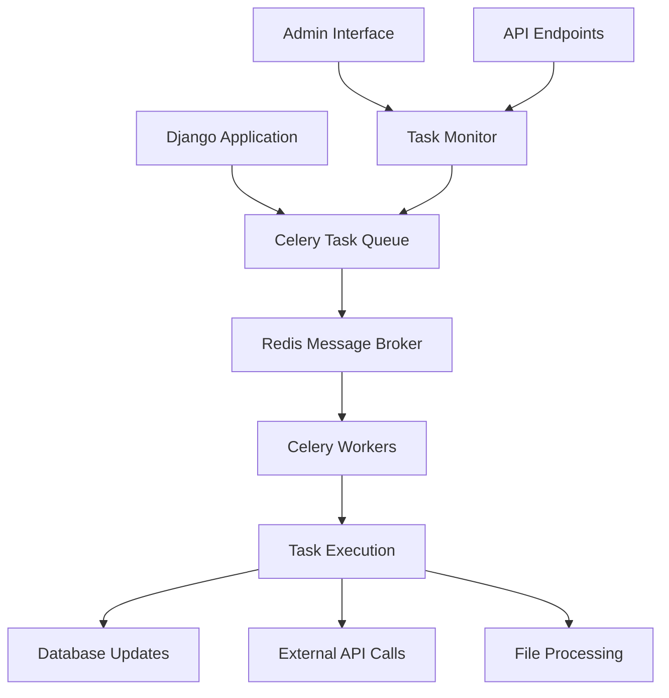

# Background Tasks System

## Overview

The Background Tasks System in MusicChartsAI provides comprehensive asynchronous task processing using Celery. This system handles all time-consuming operations including data synchronization, API calls, file processing, and analytics calculations without blocking the main application.

## Architecture

### Core Components



### Task Categories

1. **Data Synchronization Tasks**
   - Chart ranking synchronization
   - Track metadata updates
   - Audience data fetching
   - Platform data refresh

2. **Analysis Tasks**
   - ACRCloud audio analysis
   - Fraud detection processing
   - Chart trend calculations
   - Performance analytics

3. **System Tasks**
   - Database maintenance
   - Log cleanup
   - Backup operations
   - Health checks

## Celery Configuration

### Basic Setup

The Celery configuration is located in `config/celery.py`:

```python
import os
from celery import Celery

# Set the default Django settings module for the 'celery' program.
os.environ.setdefault('DJANGO_SETTINGS_MODULE', 'config.settings')

app = Celery('config')

# Using a string here means the worker doesn't have to serialize
# the configuration object to child processes.
app.config_from_object('django.conf:settings', namespace='CELERY')

# Load task modules from all registered Django apps.
app.autodiscover_tasks()
```

### Settings Configuration

Key Celery settings in `config/settings.py`:

```python
# Celery Configuration
CELERY_BROKER_URL = os.environ.get("CELERY_BROKER", "redis://localhost:6379")
CELERY_RESULT_BACKEND = os.environ.get("CELERY_BROKER", "redis://localhost:6379")

# Task Configuration
CELERY_TASK_TRACK_STARTED = True
CELERY_TASK_TIME_LIMIT = 30 * 60  # 30 minutes
CELERY_TASK_SOFT_TIME_LIMIT = 25 * 60  # 25 minutes
CELERY_WORKER_PREFETCH_MULTIPLIER = 1

# Result Configuration
CELERY_RESULT_BACKEND = "django-db"
CELERY_RESULT_EXTENDED = True
CELERY_RESULT_EXPIRES = 60 * 60 * 24 * 30  # 30 days

# Serialization
CELERY_ACCEPT_CONTENT = ["json"]
CELERY_TASK_SERIALIZER = 'json'
CELERY_RESULT_SERIALIZER = 'json'

# Concurrency Limits
CELERY_WORKER_CONCURRENCY = 4
CELERY_TASK_ANNOTATIONS = {
    'apps.soundcharts.tasks.sync_chart_rankings_task': {'rate_limit': '2/m'},
    'apps.soundcharts.tasks.fetch_track_metadata_task': {'rate_limit': '2/m'},
    'apps.acrcloud.tasks.analyze_song_task': {'rate_limit': '1/m'},
}
```

## Task Management

### Task Scripts Directory

Custom task scripts are stored in the `tasks_scripts/` directory:

```
tasks_scripts/
├── check-db-health.py          # Database health monitoring
├── check-disk-free.py         # Disk space monitoring
├── clean-database.py          # Database cleanup operations
└── backup-database.py         # Database backup tasks
```

### Creating Custom Tasks

#### Example: Database Backup Task

```python
# tasks_scripts/backup_database.py
import os
import shutil
from datetime import datetime
from django.conf import settings

def main():
    """Create a database backup with timestamp."""
    try:
        # Get database file path
        db_path = settings.DATABASES['default']['NAME']
        
        # Create backup directory if it doesn't exist
        backup_dir = "db_backups"
        if not os.path.exists(backup_dir):
            os.makedirs(backup_dir)
        
        # Generate backup filename with timestamp
        timestamp = datetime.now().strftime('%Y%m%d_%H%M%S')
        backup_filename = f"db_backup_{timestamp}.sqlite3"
        backup_path = os.path.join(backup_dir, backup_filename)
        
        # Create backup
        shutil.copy2(db_path, backup_path)
        
        print(f"Database backup created: {backup_path}")
        return 0
        
    except Exception as e:
        print(f"Backup failed: {str(e)}")
        return 1

if __name__ == "__main__":
    exit(main())
```

#### Example: Data Cleanup Task

```python
# tasks_scripts/cleanup_old_data.py
from datetime import datetime, timedelta
from django.utils import timezone
from apps.soundcharts.models import ChartRanking, TrackAudienceTimeSeries

def main():
    """Clean up old data to maintain database performance."""
    try:
        # Calculate cutoff date (90 days ago)
        cutoff_date = timezone.now() - timedelta(days=90)
        
        # Clean up old chart rankings
        old_rankings = ChartRanking.objects.filter(
            fetched_at__lt=cutoff_date
        )
        rankings_count = old_rankings.count()
        old_rankings.delete()
        
        # Clean up old audience data
        old_audience = TrackAudienceTimeSeries.objects.filter(
            fetched_at__lt=cutoff_date
        )
        audience_count = old_audience.count()
        old_audience.delete()
        
        print(f"Cleaned up {rankings_count} old chart rankings")
        print(f"Cleaned up {audience_count} old audience records")
        return 0
        
    except Exception as e:
        print(f"Cleanup failed: {str(e)}")
        return 1

if __name__ == "__main__":
    exit(main())
```

## Core Task Implementations

### Chart Synchronization Tasks

#### Main Sync Task

```python
# apps/soundcharts/tasks.py
from celery import shared_task
from django.utils import timezone
from .models import ChartSyncSchedule, ChartSyncExecution
from .services import SoundchartsService

@shared_task(bind=True, max_retries=3)
def sync_chart_rankings_task(self, schedule_id, execution_id):
    """Sync chart rankings for a specific schedule."""
    try:
        # Get schedule and execution records
        schedule = ChartSyncSchedule.objects.get(id=schedule_id)
        execution = ChartSyncExecution.objects.get(id=execution_id)
        
        # Update execution status
        execution.status = 'running'
        execution.started_at = timezone.now()
        execution.save()
        
        # Initialize service
        service = SoundchartsService()
        
        # Determine missing periods
        missing_periods = schedule.get_missing_periods()
        
        # Process each missing period
        rankings_created = 0
        tracks_created = 0
        
        for period in missing_periods:
            result = service.fetch_chart_rankings(
                chart_id=schedule.chart.soundcharts_id,
                start_date=period['start'],
                end_date=period['end']
            )
            
            rankings_created += result['rankings_created']
            tracks_created += result['tracks_created']
        
        # Mark execution as completed
        execution.mark_completed(
            rankings_created=rankings_created,
            tracks_created=tracks_created
        )
        
        # Update schedule
        schedule.last_sync_at = timezone.now()
        schedule.calculate_next_sync()
        schedule.total_executions += 1
        schedule.successful_executions += 1
        schedule.save()
        
        return {
            'status': 'success',
            'rankings_created': rankings_created,
            'tracks_created': tracks_created
        }
        
    except Exception as exc:
        # Handle retries
        execution.mark_failed(str(exc))
        schedule.failed_executions += 1
        schedule.save()
        
        # Retry with exponential backoff
        raise self.retry(exc=exc, countdown=60 * (2 ** self.request.retries))
```

#### Scheduled Sync Processor

```python
@shared_task
def process_scheduled_chart_syncs():
    """Process all due chart sync schedules."""
    from django.utils import timezone
    
    # Find due schedules
    due_schedules = ChartSyncSchedule.objects.filter(
        is_active=True,
        next_sync_at__lte=timezone.now()
    )
    
    for schedule in due_schedules:
        # Create execution record
        execution = ChartSyncExecution.objects.create(
            schedule=schedule,
            status='pending'
        )
        
        # Queue sync task
        sync_chart_rankings_task.delay(schedule.id, execution.id)
        
        # Update next sync time
        schedule.calculate_next_sync()
        schedule.save()
    
    return f"Processed {due_schedules.count()} due schedules"
```

### ACRCloud Analysis Tasks

#### Audio Analysis Task

```python
# apps/acrcloud/tasks.py
from celery import shared_task
from .models import Song, Analysis
from .services import ACRCloudService

@shared_task(bind=True, max_retries=3)
def analyze_song_task(self, song_id):
    """Analyze uploaded song using ACRCloud API."""
    try:
        song = Song.objects.get(id=song_id)
        
        # Create analysis record
        analysis = Analysis.objects.create(
            song=song,
            status='processing'
        )
        
        # Initialize service
        service = ACRCloudService()
        
        # Perform analysis
        result = service.analyze_audio(song.audio_file.path)
        
        # Update analysis record
        analysis.status = 'completed'
        analysis.raw_response = result
        analysis.save()
        
        # Generate analysis report
        service.generate_analysis_report(analysis)
        
        # Send notification
        send_analysis_complete_notification.delay(song.id, analysis.id)
        
        return {
            'status': 'success',
            'analysis_id': analysis.id,
            'song_id': song.id
        }
        
    except Exception as exc:
        # Handle retries
        if analysis:
            analysis.status = 'failed'
            analysis.error_message = str(exc)
            analysis.save()
        
        raise self.retry(exc=exc, countdown=60 * (2 ** self.request.retries))

@shared_task
def send_analysis_complete_notification(song_id, analysis_id):
    """Send notification when analysis is complete."""
    # Implementation for email/SMS notifications
    pass
```

### Metadata Fetching Tasks

#### Track Metadata Task

```python
# apps/soundcharts/tasks.py
@shared_task(bind=True, max_retries=3)
def fetch_track_metadata_task(self, track_uuid):
    """Fetch and update track metadata from Soundcharts API."""
    try:
        from .models import Track
        from .services import SoundchartsService
        
        track = Track.objects.get(uuid=track_uuid)
        service = SoundchartsService()
        
        # Fetch metadata
        metadata = service.fetch_track_metadata(track_uuid)
        
        # Update track
        track.title = metadata.get('title', track.title)
        track.artist_name = metadata.get('artist_name', track.artist_name)
        track.album_name = metadata.get('album_name', track.album_name)
        track.release_date = metadata.get('release_date', track.release_date)
        track.genre = metadata.get('genre', track.genre)
        track.metadata_updated_at = timezone.now()
        track.save()
        
        return {
            'status': 'success',
            'track_uuid': track_uuid,
            'metadata_updated': True
        }
        
    except Exception as exc:
        raise self.retry(exc=exc, countdown=60 * (2 ** self.request.retries))
```

## Task Monitoring and Management

### Admin Interface

The Django admin provides comprehensive task management:

#### Task Execution Monitoring

- **Real-time Status**: Live task status updates
- **Execution History**: Complete task execution logs
- **Error Tracking**: Detailed error messages and stack traces
- **Performance Metrics**: Task duration and resource usage

#### Task Management Actions

- **Start Tasks**: Execute custom scripts from admin
- **Cancel Tasks**: Stop running tasks gracefully
- **Retry Failed Tasks**: Restart failed executions
- **Bulk Operations**: Manage multiple tasks simultaneously

### API Endpoints

#### Task Status API

```python
# apps/tasks/views.py
from rest_framework.decorators import api_view, permission_classes
from rest_framework.permissions import IsStaffUser
from rest_framework.response import Response
from celery.result import AsyncResult

@api_view(['GET'])
@permission_classes([IsStaffUser])
def task_status(request, task_id):
    """Get the status of a specific task."""
    result = AsyncResult(task_id)
    
    return Response({
        'task_id': task_id,
        'status': result.status,
        'result': result.result if result.ready() else None,
        'traceback': result.traceback if result.failed() else None
    })
```

#### Task Queue API

```python
@api_view(['GET'])
@permission_classes([IsStaffUser])
def task_queue_status(request):
    """Get current task queue status."""
    from celery import current_app
    
    # Get active tasks
    active_tasks = current_app.control.inspect().active()
    
    # Get scheduled tasks
    scheduled_tasks = current_app.control.inspect().scheduled()
    
    return Response({
        'active_tasks': active_tasks,
        'scheduled_tasks': scheduled_tasks,
        'worker_count': len(active_tasks.get('celery@worker', [])),
    })
```

## Task Scheduling

### Celery Beat Configuration

For periodic tasks, configure Celery Beat:

```python
# config/settings.py
from celery.schedules import crontab

CELERY_BEAT_SCHEDULE = {
    'process-scheduled-syncs': {
        'task': 'apps.soundcharts.tasks.process_scheduled_chart_syncs',
        'schedule': crontab(minute=0),  # Every hour
    },
    'cleanup-old-data': {
        'task': 'apps.soundcharts.tasks.cleanup_old_data_task',
        'schedule': crontab(hour=2, minute=0),  # Daily at 2 AM
    },
    'health-check': {
        'task': 'apps.tasks.tasks.system_health_check',
        'schedule': crontab(minute='*/15'),  # Every 15 minutes
    },
}
```

### Custom Scheduling

#### Dynamic Task Scheduling

```python
# apps/soundcharts/tasks.py
@shared_task
def schedule_chart_sync(chart_id, frequency='weekly'):
    """Schedule a chart sync task."""
    from .models import ChartSyncSchedule
    
    schedule = ChartSyncSchedule.objects.create(
        chart_id=chart_id,
        sync_frequency=frequency,
        is_active=True
    )
    
    # Calculate next sync time
    schedule.calculate_next_sync()
    schedule.save()
    
    return f"Scheduled sync for chart {chart_id}"
```

## Error Handling and Retry Logic

### Retry Configuration

```python
# apps/soundcharts/tasks.py
@shared_task(bind=True, autoretry_for=(Exception,), retry_kwargs={'max_retries': 3, 'countdown': 60})
def robust_api_call_task(self, api_endpoint, data):
    """Task with automatic retry on failure."""
    try:
        # API call implementation
        response = make_api_call(api_endpoint, data)
        return response
        
    except Exception as exc:
        # Log the error
        logger.error(f"API call failed: {exc}")
        
        # Retry with exponential backoff
        raise self.retry(exc=exc, countdown=60 * (2 ** self.request.retries))
```

### Error Notifications

```python
@shared_task
def notify_task_failure(task_name, error_message, user_id):
    """Send notification when a task fails."""
    from django.core.mail import send_mail
    from django.contrib.auth.models import User
    
    user = User.objects.get(id=user_id)
    
    send_mail(
        subject=f'Task Failed: {task_name}',
        message=f'Task {task_name} failed with error: {error_message}',
        from_email='noreply@musicchartsai.com',
        recipient_list=[user.email],
    )
```

## Performance Optimization

### Task Optimization Strategies

1. **Batch Processing**: Group similar operations together
2. **Connection Pooling**: Reuse database connections
3. **Caching**: Cache frequently accessed data
4. **Resource Limits**: Set appropriate concurrency limits

#### Example: Batch Processing

```python
@shared_task
def batch_process_tracks(track_ids):
    """Process multiple tracks in a single task."""
    from .models import Track
    from .services import SoundchartsService
    
    service = SoundchartsService()
    results = []
    
    # Process tracks in batches
    for i in range(0, len(track_ids), 10):
        batch = track_ids[i:i+10]
        batch_results = service.batch_fetch_metadata(batch)
        results.extend(batch_results)
    
    return results
```

### Resource Management

```python
# config/settings.py
CELERY_WORKER_CONCURRENCY = 4
CELERY_WORKER_MAX_TASKS_PER_CHILD = 1000
CELERY_WORKER_DISABLE_RATE_LIMITS = False

# Memory management
CELERY_WORKER_MEMORY_LIMIT = 2000000  # 2GB
CELERY_WORKER_MAX_MEMORY_PER_CHILD = 200000  # 200MB
```

## Monitoring and Logging

### Task Logging

```python
import logging

logger = logging.getLogger(__name__)

@shared_task
def logged_task(task_data):
    """Task with comprehensive logging."""
    logger.info(f"Starting task with data: {task_data}")
    
    try:
        # Task implementation
        result = process_data(task_data)
        logger.info(f"Task completed successfully: {result}")
        return result
        
    except Exception as exc:
        logger.error(f"Task failed: {exc}", exc_info=True)
        raise
```

### Health Monitoring

```python
@shared_task
def system_health_check():
    """Monitor system health and performance."""
    import psutil
    from django.db import connection
    
    # Check database connection
    try:
        connection.ensure_connection()
        db_status = "healthy"
    except Exception as e:
        db_status = f"unhealthy: {e}"
    
    # Check system resources
    cpu_percent = psutil.cpu_percent()
    memory_percent = psutil.virtual_memory().percent
    disk_percent = psutil.disk_usage('/').percent
    
    health_data = {
        'timestamp': timezone.now().isoformat(),
        'database': db_status,
        'cpu_percent': cpu_percent,
        'memory_percent': memory_percent,
        'disk_percent': disk_percent,
    }
    
    # Log health data
    logger.info(f"System health check: {health_data}")
    
    return health_data
```

## Deployment Considerations

### Production Configuration

```python
# Production settings
CELERY_BROKER_URL = os.environ.get('REDIS_URL', 'redis://localhost:6379')
CELERY_RESULT_BACKEND = os.environ.get('REDIS_URL', 'redis://localhost:6379')

# Security
CELERY_TASK_ALWAYS_EAGER = False  # Never run tasks synchronously in production
CELERY_TASK_EAGER_PROPAGATES = True

# Performance
CELERY_WORKER_CONCURRENCY = int(os.environ.get('CELERY_WORKER_CONCURRENCY', 4))
CELERY_WORKER_PREFETCH_MULTIPLIER = 1
```

### Docker Configuration

```dockerfile
# Dockerfile for Celery worker
FROM python:3.13-slim

WORKDIR /app
COPY requirements.txt .
RUN pip install -r requirements.txt

COPY . .

CMD ["celery", "-A", "config", "worker", "-l", "info"]
```

### Supervisor Configuration

```ini
[program:celery-worker]
command=/path/to/venv/bin/celery -A config worker -l info
directory=/path/to/project
user=www-data
numprocs=1
stdout_logfile=/var/log/celery/worker.log
stderr_logfile=/var/log/celery/worker.log
autostart=true
autorestart=true
startsecs=10
stopwaitsecs=600
killasgroup=true
priority=998
```

## Troubleshooting

### Common Issues

1. **Tasks Not Executing**
   - Check Celery worker status
   - Verify Redis connection
   - Check task queue status

2. **Memory Issues**
   - Monitor worker memory usage
   - Adjust worker concurrency
   - Implement task cleanup

3. **Database Locks**
   - Use database connection pooling
   - Implement retry logic
   - Monitor database performance

### Debug Commands

```bash
# Check Celery status
celery -A config inspect active

# Check scheduled tasks
celery -A config inspect scheduled

# Check worker stats
celery -A config inspect stats

# Purge task queue
celery -A config purge
```

## Best Practices

### Task Design

1. **Idempotent Tasks**: Tasks should be safe to retry
2. **Small Tasks**: Break large operations into smaller tasks
3. **Error Handling**: Implement comprehensive error handling
4. **Resource Cleanup**: Clean up resources after task completion

### Monitoring

1. **Task Metrics**: Track task execution times and success rates
2. **Resource Usage**: Monitor CPU, memory, and disk usage
3. **Queue Length**: Monitor task queue length and processing rate
4. **Error Rates**: Track and alert on error rates

### Security

1. **Task Authentication**: Secure task execution
2. **Data Protection**: Protect sensitive data in tasks
3. **Access Control**: Limit task execution permissions
4. **Audit Logging**: Log all task executions

---

The Background Tasks System provides a robust foundation for handling all asynchronous operations in MusicChartsAI. With comprehensive monitoring, error handling, and scalability features, it ensures reliable and efficient task processing for all platform operations.
