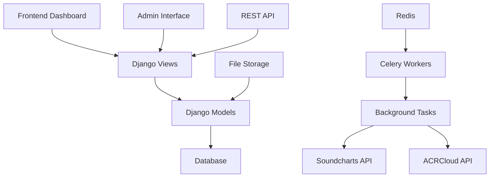

# Features Overview

## Platform Capabilities

MusicChartsAI provides comprehensive music analytics and chart management capabilities through several integrated systems:

## Core Features

### 🎵 Music Chart Management
- **Multi-Platform Support**: Spotify, Apple Music, YouTube, and more
- **Automated Synchronization**: Scheduled chart data updates
- **Historical Data**: Complete chart ranking history
- **Real-time Monitoring**: Live sync status and health metrics

### 📊 Audience Analytics
- **Time-Series Data**: Track audience growth over time
- **Multi-Platform Comparison**: Compare performance across platforms
- **Interactive Charts**: Dynamic visualizations with Chart.js
- **Data Export**: CSV and JSON export capabilities

### 🔍 Audio Analysis
- **Fraud Detection**: ACRCloud-powered copyright detection
- **Cover Detection**: Identify cover versions of existing songs
- **Lyrics Analysis**: Content similarity analysis
- **Risk Assessment**: Automated risk scoring and classification

### ⚙️ Background Processing
- **Celery Integration**: Asynchronous task processing
- **Task Monitoring**: Real-time task status and progress
- **Error Handling**: Comprehensive retry mechanisms
- **Scalable Architecture**: Horizontal scaling support

### 🎛️ Dynamic Data Management
- **Flexible Tables**: Configurable data visualization
- **RESTful API**: Programmatic access to data
- **Custom Filters**: Advanced data filtering capabilities
- **Export Functions**: Multiple export formats

## Architecture Overview

## Feature Modules

### Soundcharts Integration
- **Chart Data Fetching**: Automated chart ranking retrieval
- **Track Metadata**: Complete track information management
- **Audience Data**: Time-series audience analytics
- **Platform Management**: Multi-platform chart support

### ACRCloud Analysis
- **Audio Upload**: Support for multiple audio formats
- **Fingerprint Analysis**: Exact match detection
- **Cover Detection**: Cover version identification
- **Fraud Assessment**: Risk scoring and classification

### Dynamic Tables & API
- **Configurable Tables**: Flexible data presentation
- **RESTful Endpoints**: Programmatic data access
- **Custom Filtering**: Advanced search capabilities
- **Export Functions**: Multiple data formats

### Chart Management
- **Sync Scheduling**: Automated data synchronization
- **Health Monitoring**: Chart update status tracking
- **Error Handling**: Comprehensive retry mechanisms
- **Performance Metrics**: Sync success rates and timing

### User Management
- **Authentication**: Secure user sessions
- **Role-based Access**: Admin and user permissions
- **Profile Management**: User account administration
- **Security Features**: CSRF protection and validation

### Background Tasks
- **Celery Integration**: Asynchronous task processing
- **Task Monitoring**: Real-time status tracking
- **Error Recovery**: Automatic retry mechanisms
- **Resource Management**: Memory and CPU optimization

## Integration Points

### External APIs
- **Soundcharts API**: Chart data and metadata
- **ACRCloud API**: Audio analysis and fraud detection
- **Future Integrations**: Additional music services

### Internal Systems
- **Django Admin**: Administrative interface
- **REST API**: Programmatic access
- **Celery Tasks**: Background processing
- **File Storage**: Media and document management

## Performance Features

### Scalability
- **Horizontal Scaling**: Multiple worker support
- **Database Optimization**: Efficient query patterns
- **Caching**: Redis-based performance enhancement
- **Load Balancing**: Distributed processing

### Monitoring
- **Health Checks**: System status monitoring
- **Performance Metrics**: Response time tracking
- **Error Logging**: Comprehensive error tracking
- **Resource Usage**: CPU and memory monitoring

## Security Features

### Data Protection
- **API Security**: Token-based authentication
- **File Validation**: Secure file upload handling
- **CSRF Protection**: Cross-site request forgery prevention
- **Input Sanitization**: Data validation and cleaning

### Access Control
- **User Authentication**: Secure login system
- **Role-based Permissions**: Granular access control
- **Session Management**: Secure session handling
- **Audit Logging**: User action tracking

## Future Enhancements

### Planned Features
- **Real-time Updates**: WebSocket-based live data
- **Advanced Analytics**: Machine learning insights
- **Mobile App**: Native mobile application
- **API Marketplace**: Third-party integrations

### Scalability Improvements
- **Microservices**: Service-oriented architecture
- **Container Orchestration**: Kubernetes deployment
- **Advanced Caching**: Multi-layer caching strategy
- **Database Sharding**: Horizontal database scaling

---

**Ready to explore specific features?** Check out our detailed guides:
- [Soundcharts Integration](soundcharts-integration.md)
- [ACRCloud Analysis](acrcloud-analysis.md)
- [Background Tasks](background-tasks.md)
- [Dynamic Tables & API](dynamic-tables-api.md)
