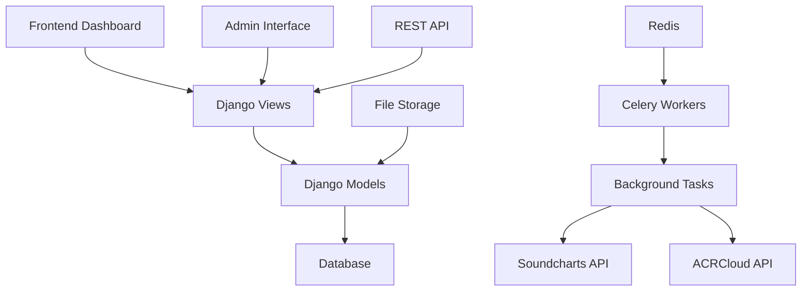

# MusicChartsAI Documentation

Welcome to the comprehensive documentation for **MusicChartsAI** - a powerful music analytics platform that integrates with Soundcharts and ACRCloud APIs to provide detailed music chart analysis, audience insights, and fraud detection capabilities.

## 🎵 What is MusicChartsAI?

MusicChartsAI is a Django-based web application that provides:

- **Music Chart Analytics**: Real-time tracking of music charts across multiple platforms
- **Audience Insights**: Time-series analysis of track audience data
- **Fraud Detection**: ACRCloud-powered audio analysis and copyright detection
- **Dynamic Data Management**: Flexible tables and API endpoints for data manipulation
- **Background Task Processing**: Automated data synchronization using Celery

## 🚀 Quick Start

Get up and running with MusicChartsAI in minutes:

1. **[Installation](getting-started/installation.md)** - Set up your development environment
2. **[Configuration](getting-started/configuration.md)** - Configure API keys and settings
3. **[Quick Start Guide](getting-started/quick-start.md)** - Run your first data sync

## 📚 Documentation Sections

### Getting Started
- **[Installation](getting-started/installation.md)** - Complete setup guide
- **[Configuration](getting-started/configuration.md)** - Environment and API configuration
- **[Quick Start](getting-started/quick-start.md)** - First steps with the platform

### Features
- **[Overview](features/overview.md)** - Platform capabilities and architecture
- **[Soundcharts Integration](features/soundcharts-integration.md)** - Music chart data management
- **[ACRCloud Analysis](features/acrcloud-analysis.md)** - Audio analysis and fraud detection
- **[Dynamic Tables & API](features/dynamic-tables-api.md)** - Flexible data management
- **[Chart Management](features/chart-management.md)** - Chart synchronization and monitoring
- **[User Management](features/user-management.md)** - Authentication and authorization
- **[Background Tasks](features/background-tasks.md)** - Celery task processing and automation

### API Reference
- **[Overview](api/overview.md)** - API architecture and authentication
- **[External APIs](api/external-apis.md)** - Soundcharts and ACRCloud integration
- **[Internal APIs](api/internal-apis.md)** - REST API endpoints (coming soon)
- **[Authentication](api/authentication.md)** - API security and access control

### Admin Guide
- **[Dashboard Overview](admin/dashboard-overview.md)** - Admin interface navigation
- **[Data Management](admin/data-management.md)** - Managing charts, tracks, and rankings
- **[Task Monitoring](admin/task-monitoring.md)** - Background task management
- **[User Administration](admin/user-administration.md)** - User management and permissions

### Deployment
- **[Production Setup](deployment/production-setup.md)** - Production deployment guide
- **[Docker Deployment](deployment/docker-deployment.md)** - Containerized deployment
- **[CI/CD Pipeline](deployment/ci-cd-pipeline.md)** - Automated deployment
- **[Environment Configuration](deployment/environment-configuration.md)** - Environment variables and settings

### Development
- **[Architecture](development/architecture.md)** - System architecture and design patterns
- **[Contributing](development/contributing.md)** - Contributing to the project
- **[Testing](development/testing.md)** - Testing strategies and tools
- **[Troubleshooting](development/troubleshooting.md)** - Common issues and solutions

## 🏗️ Architecture Overview

MusicChartsAI is built on a modern Django architecture with the following key components:

### Key Technologies

- **Backend**: Django 5.2 with Python 3.13
- **Frontend**: Tailwind CSS with Flowbite components
- **Task Processing**: Celery with Redis message broker
- **Database**: SQLite (default), PostgreSQL/MySQL supported
- **API Integration**: Soundcharts API, ACRCloud API
- **Charts**: ApexCharts for data visualization

## 🔧 Core Features

### Music Chart Management
- **Multi-Platform Support**: Spotify, Apple Music, YouTube, and more
- **Automated Synchronization**: Scheduled chart data updates
- **Historical Data**: Complete chart ranking history
- **Real-time Monitoring**: Live sync status and health metrics

### Audience Analytics
- **Time-Series Data**: Track audience growth over time
- **Multi-Platform Comparison**: Compare performance across platforms
- **Interactive Charts**: Dynamic visualizations with Chart.js
- **Data Export**: CSV and JSON export capabilities

### Audio Analysis
- **Fraud Detection**: ACRCloud-powered copyright detection
- **Cover Detection**: Identify cover versions of existing songs
- **Lyrics Analysis**: Content similarity analysis
- **Risk Assessment**: Automated risk scoring and classification

### Background Processing
- **Celery Integration**: Asynchronous task processing
- **Task Monitoring**: Real-time task status and progress
- **Error Handling**: Comprehensive retry mechanisms
- **Scalable Architecture**: Horizontal scaling support

## 📊 Dashboard Features

The MusicChartsAI dashboard provides comprehensive analytics:

- **Weekly Rankings**: Chart rankings fetched over time
- **Platform Performance**: Top-performing music platforms
- **Track Analytics**: Most popular tracks across charts
- **System Health**: Chart synchronization status and metrics
- **Task Management**: Background task monitoring and control

## 🔐 Security & Authentication

- **Session-based Authentication**: Secure user sessions
- **Role-based Access**: Admin and user permission levels
- **API Security**: Token-based authentication for API endpoints
- **Data Protection**: Secure handling of sensitive API keys

## 🚀 Getting Help

- **Documentation**: Comprehensive guides for all features
- **API Reference**: Complete API documentation
- **Troubleshooting**: Common issues and solutions
- **Community**: Join our Discord community for support

## 📈 Roadmap

### Upcoming Features
- **Advanced Analytics**: Machine learning-powered insights
- **Real-time Updates**: WebSocket-based live data
- **Mobile App**: Native mobile application
- **API Marketplace**: Third-party integrations
- **Enterprise Features**: Advanced reporting and analytics

---

**Ready to get started?** Check out our [Installation Guide](getting-started/installation.md) to set up your MusicChartsAI instance!
